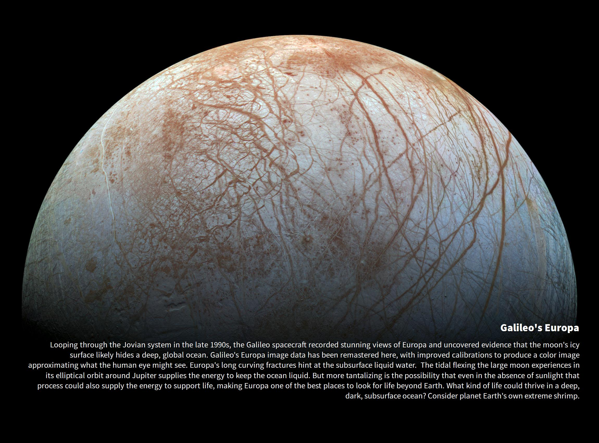
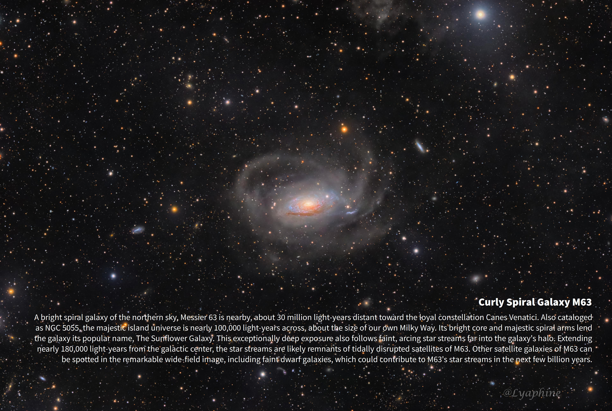
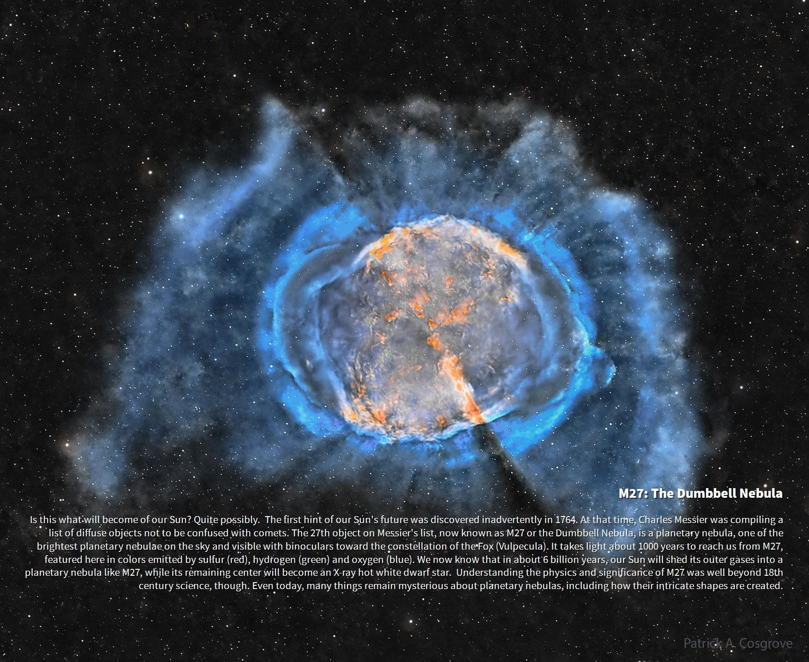

# Astronomy Picture Of The Day Wallpaper App
This desktop wallpaper app automatically updates your wallpaper with the latest Astronomy Picture of the Day (APOD) from the official NASA APOD website. The app runs in the background and includes three timers to check and update the wallpaper at different intervals, ensuring that you always have a fresh and stunning space-themed wallpaper on your desktop.

## Features
-   Automatically updates wallpaper with the latest APOD from the NASA APOD website
-   Runs in the background when you activate the app, so you don't have to update the wallpaper manually
-   Three timers for wallpaper updates:
    -   On Startup timer: Wallpaper is updated with the latest APOD upon app startup
    -   Checker timer: Wallpaper is checked and updated with the latest APOD every 60 minutes
    -   Daily timer: Wallpaper is updated with the latest APOD daily at 5:15 am UTC, only if a new photo is available on the website
- There is also a timer, when you have an app activated and there is no internet connection or the server has a problem, it will handle the issues and notify the user about retrying to get APOD after 10 minutes, after the third attempt, it will try after 30 minutes by checker timer.
- Before proceeding to download, it will check if the current APOD is not a video format, if so, it will notify the user about it and disable the checker timer, and only the daily timer will run.
- Minimal and easy-to-use user interface with Activate/Deactivate buttons with textbox, where you can verify and set your API key and a coloured tray icon that changes when the app is activated.

Here are some examples of modified images that are used as wallpaper. Click any image for better resolution

## Usage
1.  Download and install the app from this Github repository, or download the latest release version
2.  Launch the app and now you can verify if your API is valid. Click "Valid and set new API key" It will create (if it doesn't already exist in your app folder) or modify the apikey.txt file.
3.  Click "Activate", you need to have a stable internet connection when you activate this app, after that, you need to restart the app. From now on, it will automatically update your wallpaper with the latest APOD upon startup. You can also modify the Daily timer when you download from the repository in WallpaperAPODruntime.cs
## Requirements
-   OS: Windows OS only (tested on Windows 10, 11)
-   .NET 6.0
-   APOD API key from NASA open API
## License
This app is released under the [MIT License](https://github.com/FrosterDune/AstronomyPictureOfTheDayWallpaperApp/blob/master/LICENSE.txt), which allows for free use, modification, and distribution, subject to the terms and conditions specified in the license file.
